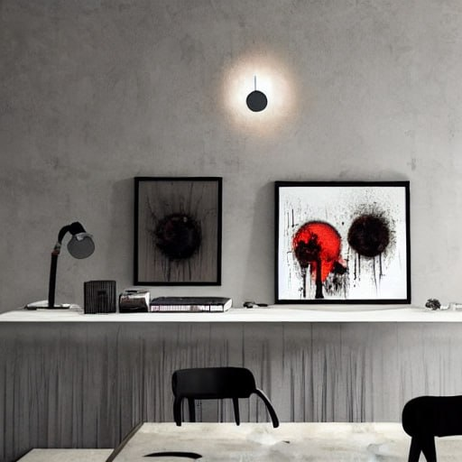
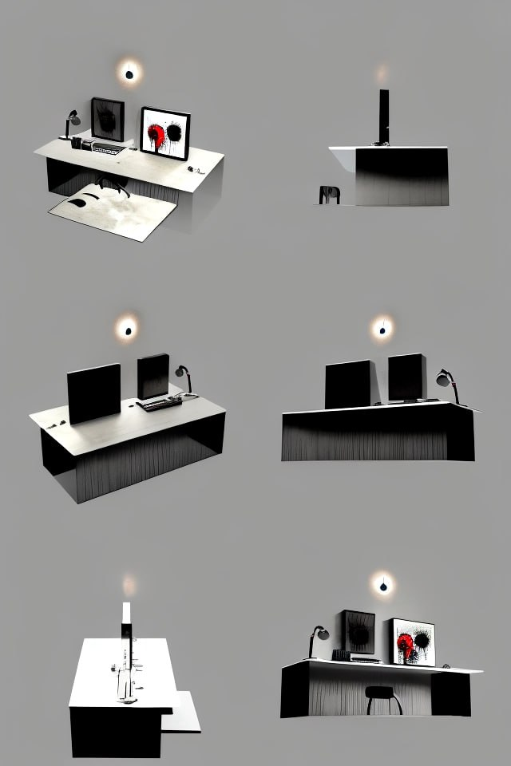
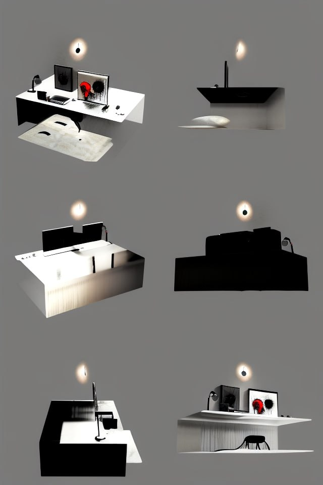
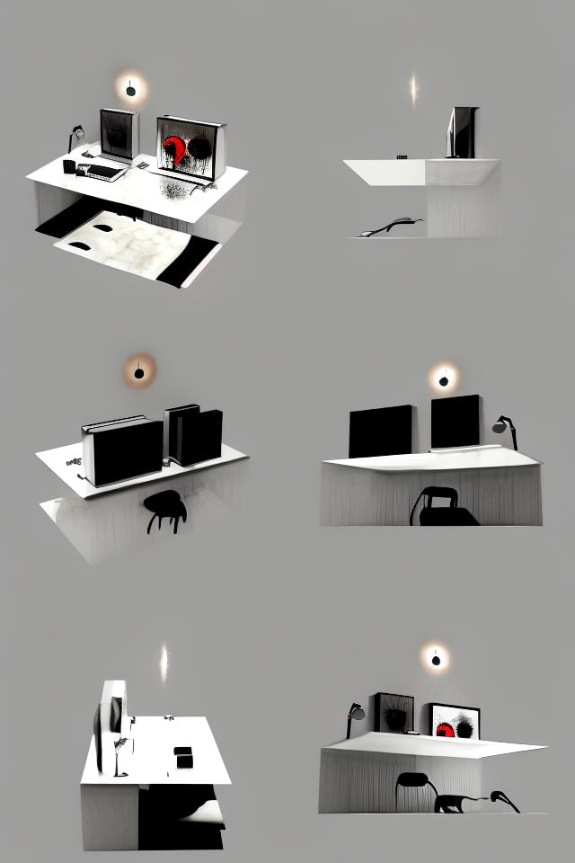

# 🌌 AI Generator: Text → Image → Multi-View (Zero123++)

Интерактивное Streamlit-приложение для генерации изображений по текстовому описанию и последующего создания нескольких ракурсов объекта с помощью diffusion-моделей. Проект объединяет Stable Diffusion и Zero123++ в одном пайплайне и подходит для прототипирования 3D / multi-view / NeRF / Computer Vision задач.

Приложение предназначено для демонстрации возможностей diffusion-моделей, быстрого получения multi-view данных

---

## 🚀 Возможности

- Генерация изображения по текстовому описанию (Stable Diffusion v1.5)
- Генерация новых ракурсов объекта (30°, 90°, 150°) с помощью Zero123++
- Web-интерфейс на Streamlit

---

## 🧠 Используемые модели

Stable Diffusion v1.5  
Модель: runwayml/stable-diffusion-v1-5  
Назначение: генерация базового изображения по текстовому промпту

Zero123++  
Модель: sudo-ai/zero123plus-v1.2  
Назначение: генерация новых ракурсов объекта с управлением камерой через параметр azimuth

---

## 🖥️ Принцип работы

1. Пользователь вводит текстовое описание сцены  
2. Stable Diffusion генерирует основное изображение  
3. Zero123++ создаёт дополнительные виды объекта с разных углов  
4. Все результаты отображаются в интерфейсе Streamlit  

---
## 🖼️ Пример работы

**Текстовый запрос:**
a dark empty house, dreamcore art, cozy lighting

### 1️⃣ Сгенерированное базовое изображение (Stable Diffusion)



Модель Stable Diffusion v1.5 генерирует исходное изображение по текстовому описанию сцены.

---

### 2️⃣ Сгенерированные ракурсы (Zero123++)

**Азимут 30°**



**Азимут 90°**



**Азимут 150°**



Zero123++ используется для генерации новых ракурсов объекта на основе одного изображения, что позволяет получить multi-view представление сцены.

---

## ⚙️ Установка и запуск

```bash
git clone https://github.com/Aremkk/Streamlit-for-ML-models.git
cd Streamlit-for-ML-models
pip install -r requirements.txt
streamlit run app.py

---

